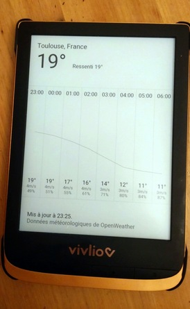

# Taranis

> Taranis est un dieu du Ciel et de l'Orage de la mythologie celtique
> gauloise.

Local weather data on your [PocketBook](https://pocketbook.ch/en-ch)
e-book reader.



Consult the [NEWS file](NEWS.md) for notable changes between versions.

## Build

Clone the source repository, populate Git submodules, **edit
[crossfile_arm.ini](./crossfile_arm.ini) file to update absolute
paths**, then build with [Meson](https://mesonbuild.com).

```
git submodule init
git submodule update

meson setup builddir . --cross-file crossfile_arm.ini
pushd builddir && meson compile; popd
```

## Install

One must register to the "One Call by Call" subscription plan of
[OpenWeather](https://openweathermap.org). The first 1,000 API calls
per day are free.

Once the build is done, copy the `builddir/taranis.app` file to the
`applications` directory using a USB cable.

Create a file named `system/config/taranis.cfg` with content:
```
location_town=Toulouse
location_country=France
openweather_api_key=YOUR_API_KEY
```

## Roadmap

- Add weather icons 
- Configuration dialog
- Translations
- Add units to configuration
- Apply for free access to OpenWeather API

## Contributing

```
ninja -C builddir clang-format
```

## References

* https://github.com/pocketbook-free/InkViewDoc
* https://github.com/JuanJakobo/Pocketbook-Read-offline
* https://github.com/SteffenBauer/PocketPuzzles
* https://github.com/pmartin/pocketbook-demo
