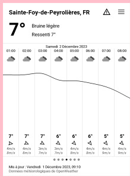
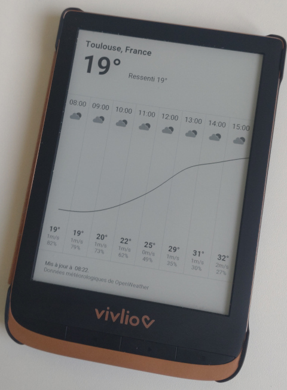

# Taranis

> Taranis est un dieu du Ciel et de l'Orage de la mythologie celtique
> gauloise.

Local weather data on your [PocketBook](https://pocketbook.ch/en-ch)
e-book reader.

## Features 🥳

* Current weather

* 24 hourly forecasts with temperature, wind speed, humidity,
  temperature curve and precipitations histogram
  
* Configurable system of units

* Translations (English, French, Polish)

Weather data is provided by [OpenWeather](https://openweathermap.org).

**The application is compatible with hardware running software version
≥6.**

Consult the [NEWS file](NEWS.md) for notable changes between versions.

## Install

1. Download the `taranis.zip` archive from the [latest
   release](https://github.com/orontee/taranis/releases/latest).
   
2. Extract the file `taranis.app` from the archive and copy that file
   to the `applications` directory of the e-book reader using a USB
   cable.

When the application is running, press the location text at the top of
the screen to enter a custom location (the _town, country_ format is
expected).

## Contributing

Instructions to install an unreleased version, debug, etc. can be
found in the [CONTRIBUTING file](./CONTRIBUTING.md).
