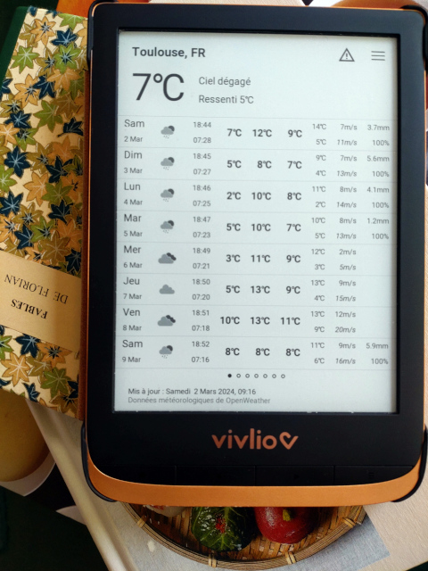

# Taranis

> Taranis est un dieu du Ciel et de l'Orage de la mythologie celtique
> gauloise.

Local weather data on your [PocketBook](https://pocketbook.ch/en-ch)
e-book reader.




Consult the [NEWS file](NEWS.md) for notable changes between versions.

## Build

1. First, clone the source repository and populate Git submodules:
   ```sh
   git submodule init
   git submodule update
   ```
   
   This will populate the `SDK_6.3.0` directory with the PocketBook
   SDK.

2. Generate the cross compilation `crossfile_arm.ini` file using the provided template
   [crossfile_arm.ini.in](./crossfile_arm.ini.in):
   ```sh
   export PWDESC=$(echo $PWD | sed 's_/_\\/_g')
   sed "s/@pwd@/$PWDESC/g" crossfile_arm.ini.in > crossfile_arm.ini
   ```

3. Download, build and install source code of the [GNU Scientific
   Library dependency](https://www.gnu.org/software/gsl/):
   ```sh
   pushd 3rd-parties
   wget https://ftp.gnu.org/gnu/gsl/gsl-2.7.1.tar.gz
   tar -xzf gsl-2.7.1.tar.gz
   CROSS=arm-obreey-linux-gnueabi
   ./configure --prefix=$PWD/../../SDK_6.3.0/SDK-B288/usr/$CROSS/sysroot \
               --host=$CROSS \
               --build=x86_64-pc-linux-gnu \
               --target=$CROSS \
      CC=$PWD/../../SDK_6.3.0/SDK-B288/usr/bin/$CROSS-clang \
      CXX=$PWD/../../SDK_6.3.0/SDK-B288/usr/bin/$CROSS-clang++ \
      AR=$PWD/../../SDK_6.3.0/SDK-B288/usr/bin/$CROSS-ar \
      STRIP=$PWD/../../SDK_6.3.0/SDK-B288/usr/bin/$CROSS-strip \
      RANLIB=$PWD/../../SDK_6.3.0/SDK-B288/usr/bin/$CROSS-ranlib \
      PKGCONFIG=$PWD/../../SDK_6.3.0/SDK-B288/usr/bin/pkg-config \
      CFLAGS="-march=armv7-a -mtune=cortex-a8 -mfpu=neon -mfloat-abi=softfp"
   make -j4
   make install
   popd
   ```

4. Finally build the application:
   ```sh
   meson setup builddir . --cross-file crossfile_arm.ini
   pushd builddir && meson compile; popd
   ```

## Install

One must register to the "One Call by Call" subscription plan of
[OpenWeather](https://openweathermap.org). The first 1,000 API calls
per day are free.

Once the build is done, copy the `builddir/taranis.app` file to the
`applications` directory using a USB cable.

Create a file named `system/config/taranis.cfg` with content:
```
location_town=Toulouse
location_country=France
openweather_api_key=YOUR_API_KEY
```

## Roadmap

- Add weather icons
- Configuration dialog
- Translations
- Add units to configuration
- Apply for free access to OpenWeather API

## Contributing

```
ninja -C builddir clang-format
```

## References

* https://github.com/pocketbook-free/InkViewDoc
* https://github.com/JuanJakobo/Pocketbook-Read-offline
* https://github.com/SteffenBauer/PocketPuzzles
* https://github.com/pmartin/pocketbook-demo
