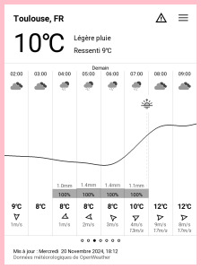

# Taranis

> Taranis est un dieu du Ciel et de l'Orage de la mythologie celtique
> gauloise.

Local weather data on your [PocketBook](https://pocketbook.ch/en-ch)
e-book reader.




Consult the [NEWS file](NEWS.md) for notable changes between versions.

## Install

1. Download the `taranis.zip` archive from the [latest
   release](https://github.com/orontee/taranis/releases/latest).
   
2. Extract the file `taranis.app` from the archive and copy that file
   to the `applications` directory of the e-book reader using a USB
   cable.

2. Create a file named `system/config/taranis.cfg` with content like the following:
   ```
   location_town=Toulouse
   location_country=France
   ```

## Roadmap

- Localization
- Configuration dialog
- Units choice

## Contributing

Instructions to install an unreleased version, debug, etc. can be found
in the [CONTRIBUTING file](./CONTRIBUTING.md).
