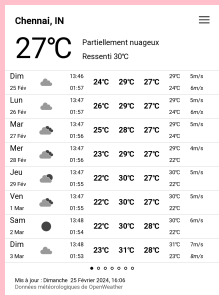

# Taranis

> Taranis est un dieu du Ciel et de l'Orage de la mythologie celtique
> gauloise.

Local weather data on your [PocketBook](https://pocketbook.ch/en-ch)
e-book reader.

 

## Features 🥳

* Current weather

* 8 daily forecasts with sunrise/sunset hour, morning, day and evening
  temperatures, wind speed, wind gust and precipitations.

* 24 hourly forecasts with temperature, wind direction, wind speed,
  wind gust, temperature curve and precipitations histogram
  
* Government weather alerts
  
* Configuration editor for system of units, custom API key, etc.

* History of locations, favorite locations

* Generation of shutdown logo

* Translations (English, Czech, French, Polish, Serbian)

Weather data is provided by [OpenWeather](https://openweather.co.uk).

Positive feedback were received for Vivilo Touch HD Plus, PocketBook
Touch HD 3, InkPad 3, InkPad Color 2, InkPad Color 3, PocketBook Verse
(The application should be compatible with hardware running software
version ≥6).

Consult the [NEWS file](NEWS.md) for notable changes between versions.

## Privacy policy

Note that the only external service called by Taranis is provided by
[OpenWeather](https://openweather.co.uk) and [their privacy
policy](https://openweather.co.uk/privacy-policy) when one is using
their APIs is quite clear:

>  Please note, that we do not collect or store any parameters from
>  your API requests, such as locations/ZIP-codes/city names, units
>  measurements, data format, etc. When you make API requests, we also
>  do not collect or store your IP address, user agent and other API
>  request parameters.

## Install

1. Download the `taranis.zip` archive from the [latest
   release](https://github.com/orontee/taranis/releases/latest).
   
2. Extract the file `taranis.pbi` from the archive and copy that file
   to the e-book reader.
   
3. The downloaded file will appear as a book in the library. Open that
   book to start the installation process.
   
4. After the installation, the "book" can be suppressed from the
   library and the device.

Optionally, a custom icon can be associated to the application;
Instructions are given in [Desktop
integration](./docs/desktop_integration.md#application-icon).

## Configuration

Note that the Openweather API key distributed with the application is
rate limited. A custom API key can be specified through the
"Parameters…" menu item (See [OpenWeather](https://openweathermap.org)
for instructions on how to register and generate API keys).

Another parameter allows to enable/disable generation of a shutdown
logo. Instructions are given in [Desktop
integration](./docs/desktop_integration.md#shutdown-logo) on how to
setup the device to effectively display this logo on power off.

## Contributing

No developer skills are required to contribute to translations or add
support for new languages, thanks to the [Weblate
platform](https://hosted.weblate.org/projects/taranis/taranis/). More
on this topic in the [translations
documentation](./po/translations.md).

Instructions to install an unreleased version, debug, etc. can be
found in the [CONTRIBUTING guide](./CONTRIBUTING.md).
